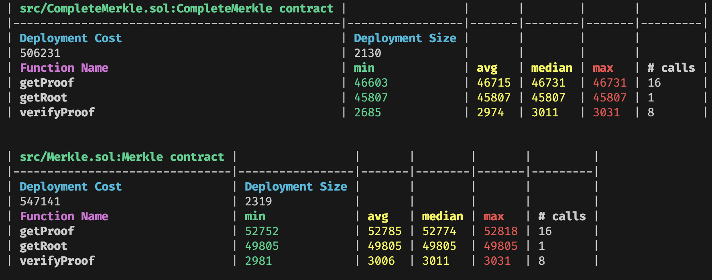

## Merkle Generator and Prover in Solidity


### Overview
Murky contains contracts that can generate merkle roots and proofs. Murky also performs inclusion verification. A couple of default implementations are available out-of-the-box:

1. [`Merkle.sol`](./src/Merkle.sol) is the original Murky implementation. It implements the tree as a [Full Binary Tree](https://xlinux.nist.gov/dads/HTML/fullBinaryTree.html).

2. [`CompleteMerkle.sol`](./src/CompleteMerkle.sol) is a merkle tree implementation using [Complete Binary Trees](https://xlinux.nist.gov/dads/HTML/completeBinaryTree.html). Some external libraries, particulary front-end or off-chain ones, use this type of tree.

By default, both trees use sorted concatentation based hashing; you can also "bring your own" hashing function by inherting from [`MurkyBase.sol`](./src/common/MurkyBase.sol).

The root generation, proof generation, and verification functions are all fuzz tested (configured 10,000 runs by default) using arbitrary bytes32 arrays and uint leaves. See [testing](#testing).

> Note: Code is not audited (yet). Please do your own due dilligence testing if you are planning to use this code!

You can currently see Murky in action in the [Seaport](https://github.com/ProjectOpenSea/Seaport) test suite.

### Building Locally
You can run the repo using [Foundry](https://github.com/gakonst/foundry).
1. clone the repo
2. `forge install`
3. `forge test`

### Example Usage
```solidity
// Initialize
Merkle m = new Merkle();
// Toy Data
bytes32[] memory data = new bytes32[](4);
data[0] = bytes32("0x0");
data[1] = bytes32("0x1");
data[2] = bytes32("0x2");
data[3] = bytes32("0x3");
// Get Root, Proof, and Verify
bytes32 root = m.getRoot(data);
bytes32[] memory proof = m.getProof(data, 2); // will get proof for 0x2 value
bool verified = m.verifyProof(root, proof, data[2]); // true!
assertTrue(verified);
```

### Script
`Merkle.s.sol` is implemented using `forge-std` for quick and simple interaction with the core contracts. The script reads from `script/target/input.json`, generates merkle proof using `Merkle.sol` and then outputs at `script/target/output.json`.

The hashes of the leafs are generated using `keccak256(bytes.concat(keccak256(abi.encode(...))))`, which is the same as [`OpenZeppelin/merkle-tree`](https://github.com/OpenZeppelin/merkle-tree#validating-a-proof-in-solidity).

```bash
forge script script/Merkle.s.sol
```

### Testing
The code is both "fuzz" tested and tested with standardized data. [Standard data info](./src/test/standard_data/).

When measuring a change's performance impact, please ensure you are benchmarking using standardized data only*:

```sh
forge snapshot --ffi --match-path src/test/StandardInput.t.sol
```

Passing just standardized tests is not sufficient for implementation changes. All changes must pass all tests, preferably with 10,000 fuzz runs. Slither analysis must also pass.

> * It's possible that an improvement is not adequetly revealed by the current standardized data. If that is the case, new standard data should be provided with an accompanying description/justification.

There is also [differential testing](./differential_testing/).

#### Latest Gas

---